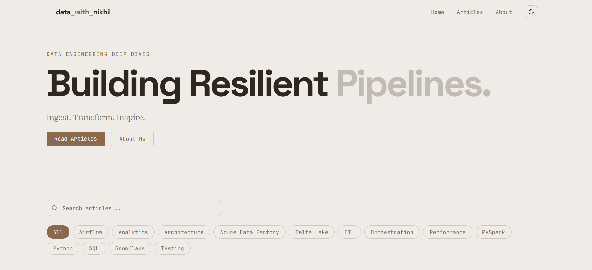
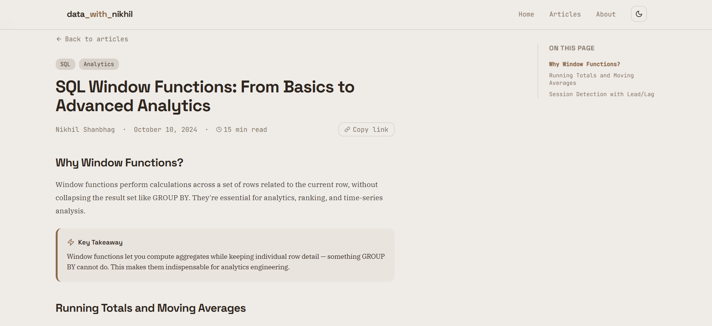

# 🚀 Data Engineering Blog

> Turning Data Chaos into Clean Pipelines.

A modern, responsive personal blog built to share knowledge on **Data Engineering**, including PySpark, SQL, Azure, and real-world data pipeline architectures.

This project is designed not just as a blog, but as a **learning platform and portfolio showcase** for data engineering concepts and projects.

---

## 🌐 Live Demo
https://datawithnikhil.netlify.app/

---

## 📸 Preview

---

## 📌 Features

### 📝 Blog Experience
- Clean and minimal UI for reading
- Categorized articles (PySpark, SQL, ADF, Snowflake, Airflow)
- Tag-based filtering by tools
- Estimated reading time for each article

### 🔍 Search & Filter
- Full-text search across articles
- Multi-select filter by tools

### 💻 Developer-Friendly Content
- Syntax-highlighted code snippets
- Copy-to-clipboard button for code blocks

### 📊 Visual Learning
- Data pipeline diagrams
- Architecture visuals
- Image support with captions

---

🤝 Contributing

Contributions, ideas, and feedback are always welcome!
If you have suggestions for improving content or features, feel free to open an issue or connect.

---

⭐ Support

If you found this project useful:
- Give it a ⭐ on GitHub
- Share it with fellow data engineers